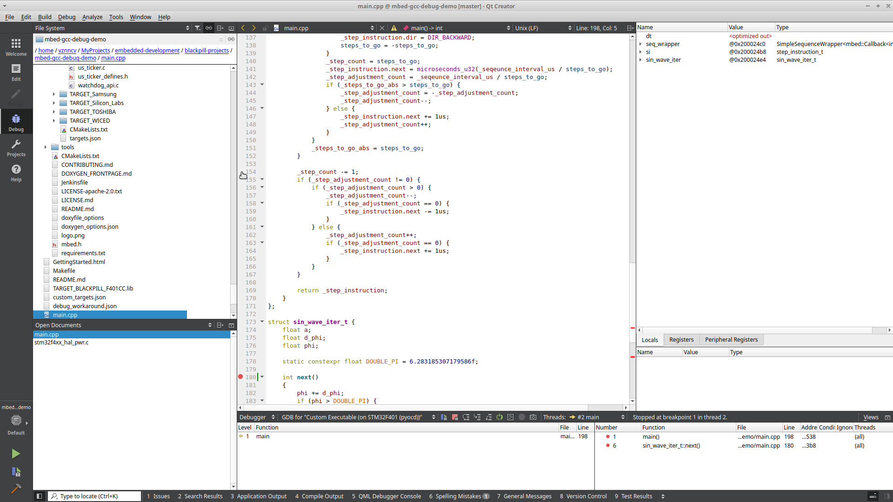
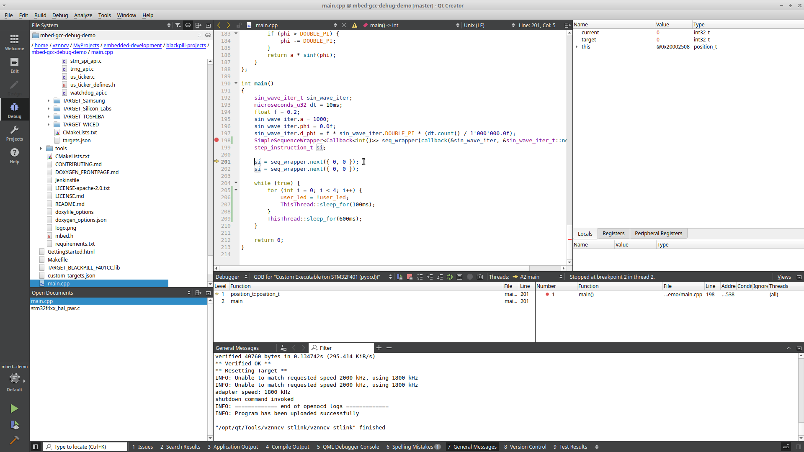
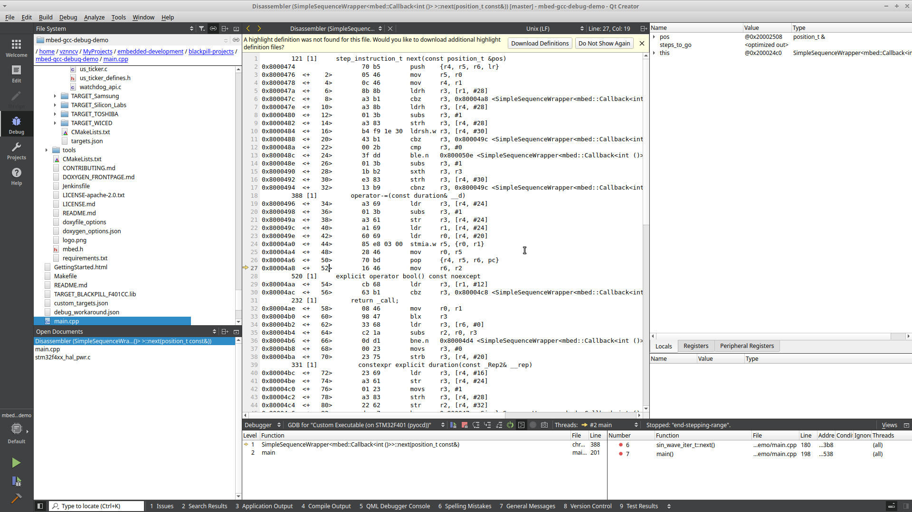
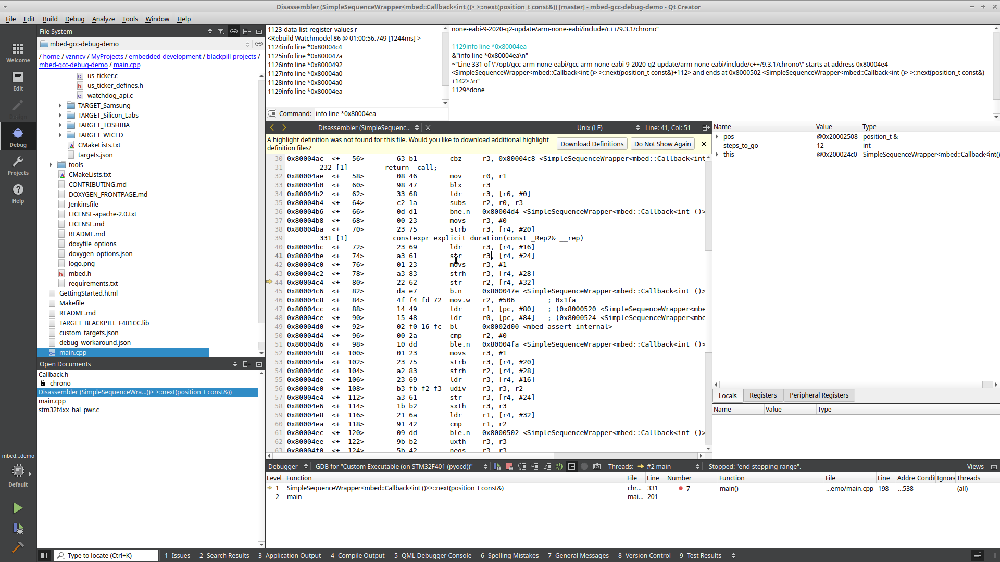

# Example of debugging issue with GCC

* mbed-os version: 6.5.0
* toolchain version: GNU Arm Embedded Toolchain 9-2020-q2-update
* gdb server: pyocd
* host: ubuntu 18.04
* IDE: QtCreator

## Description

When project is build with "debug" profile, I'm not able to debug some methods/function, especially if they use C++
templates.

This example contains method `SimpleSequenceWrapper::next` with such problems in the `main.cpp`.

1. I'm not able to add break point to some lines. When I try to add a breakpoint to line 154, the breakpoint is added to
   line 180 (method `sin_wave_iter_t::next`):

   

2. Debugger doesn't allow to "Step Into" `SimpleSequenceWrapper::next` method.

   

## Reason

I'm able to "Step Into" `SimpleSequenceWrapper::next` method with "Operate by Instruction" mode:

When I run gdb command `info list *<address>` to map address to source code, I have noticed that
`info list *<address>` output differs from `arm-none-eabi-addr2line`
(command `arm-none-eabi-addr2line -e BUILD/mbed-gcc-debug-demo.elf <address>`):

| program address | gdb `info list` command output | `arm-none-eabi-addr2line` output |
|---|---|---|
| 0x800047a | Line 121 of \"../main.cpp\" starts at address 0x8000474 <SimpleSequenceWrapper<mbed::Callback<int ()> >::next(position_t const&)> and ends at 0x8000496 | /home/vznncv/MyProjects/embedded-development/blackpill-projects/mbed-gcc-debug-demo/BUILD/../main.cpp:125 |
| 0x8000492 | Line 121 of \"../main.cpp\" starts at address 0x8000474 <SimpleSequenceWrapper<mbed::Callback<int ()> >::next(position_t const&)> and ends at 0x8000496 | /home/vznncv/MyProjects/embedded-development/blackpill-projects/mbed-gcc-debug-demo/BUILD/../main.cpp:157 |
| 0x80004ea | Line 331 of \"/opt/gcc-arm-none-eabi/gcc-arm-none-eabi-9-2020-q2-update/arm-none-eabi/include/c++/9.3.1/chrono\" starts at address 0x80004e4 | /home/vznncv/MyProjects/embedded-development/blackpill-projects/mbed-gcc-debug-demo/BUILD/../main.cpp:143 |

So the problem isn't related with IDE, but is related with gdb that isn't able to map program addresses to source code
correctly.

The gdb logs are attached [here](docs/gdb_logs.txt).

## Workaround

I have found that problem can be fixed if I change GCC flag from `-Og` to `-O0`.

## Question

Is it possible to fix debugging problems without default "debug" mbed-os profile modification?
